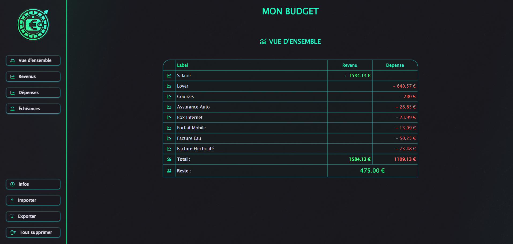
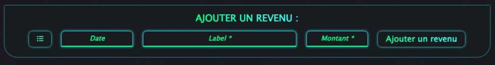

# Mon Budget 📊  
**Application de gestion budgétaire personnelle**  



## Fonctionnalités principales

### 🗃️ Gestion des données
- Stockage local dans le navigateur (localStorage)
- Export/import des données au format JSON
- Protection contre la perte de données (sauvegarde manuelle)

### 📋 Tableaux interactifs
| Section | Fonctionnalités |
|---------|-----------------|
| **Revenus** | Ajout, modification, suppression des entrées |
| **Dépenses** | Ajout, modification, suppression des entrées |
| **Échéances** | Suivi détaillé des paiements et reliquats |


### 🔢 Calculs automatiques
- Totaux mis à jour en temps réel
- Solde disponible (Revenus - Dépenses)
- Suivi des restes à payer pour les échéances

## Guide d'utilisation

### 1. Première utilisation
1. Ajoutez vos revenus via le formulaire dédié
2. Saisissez vos dépenses régulières
3. Configurez vos échéances si nécessaire



### 2. Gestion quotidienne
```
- ➕ Ajoutez de nouvelles transactions
- 🔄 Actualisez les icones/dates/labels/montants au besoin
```

## Sécurité et confidentialité

- 🔒 Données stockées localement uniquement
- Aucune collecte de données personnelles

## Structure des données

```
{
  "revenus": [
    {
      "id": "a3cg7h321e4c6h-01",
      "icon": "fa-solid fa-euro-sign",
      "date": "02",
      "label": "Salaire",
      "montant": 1584.13
    }
  ],
  "depenses": [
    {
      "id": "a3cg7h321e4c6h-07",
      "icon": "fa-solid fa-hand-holding-dollar",
      "date": "03",
      "label": "Loyer",
      "montant": 640.57
    },
    {
      "id": "a3cg7h321e4c6h-08",
      "icon": "fa-solid fa-solid fa-cart-shopping",
      "date": "03",
      "label": "Courses",
      "montant": 280
    },
    {
      "id": "a3cg7h321e4c6h-05",
      "icon": "fa-solid fa-car",
      "date": "04",
      "label": "Assurance Auto",
      "montant": 26.85
    }
  ],
  "echeances": [
    {
      "id": "a3cg7h321e4c6h-11",
      "icon": "fa-solid fa-gamepad",
      "label": "Exemple échéance",
      "date": "Décembre 2024",
      "montant": 450,
      "echeancier": [
        {
          "id": "a3cg7h321e4c6h-120",
          "icon": "fa-solid fa-gamepad",
          "date_echeance": "Novembre 2024",
          "label_echeance": "Virement 1",
          "montant_echeance": 100
        },
        {
          "id": "a3cg7h321e4c6h-130",
          "icon": "fa-solid fa-gamepad",
          "date_echeance": "Décembre 2024",
          "label_echeance": "Virement 2",
          "montant_echeance": 50
        },
        {
          "id": "a3cg7h321e4c6h-140",
          "icon": "fa-solid fa-gamepad",
          "date_echeance": "Janvier 2024",
          "label_echeance": "Virement 3",
          "montant_echeance": 90
        },
        {
          "id": "a3cg7h321e4c6h-150",
          "icon": "fa-solid fa-gamepad",
          "date_echeance": "Fevrier 2025",
          "label_echeance": "Virement 4",
          "montant_echeance": 30
        },
        {
          "id": "a3cg7h321e4c6h-160",
          "icon": "fa-solid fa-gamepad",
          "date_echeance": "Mars 2025",
          "label_echeance": "Virement 5",
          "montant_echeance": 20
        }
      ]
    }
  ]
}

```

## Support

Pour tout problème ou suggestion :

[Ouvrir une issue](https://github.com/BreureThierry/Mon_Bugdet/issues)

Contact : thierry.breure@gmail.com